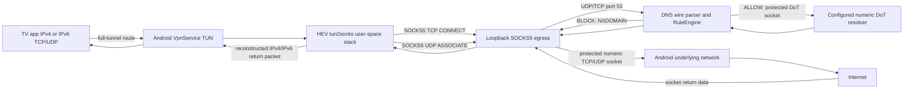

# Forwarding Architecture Decision

**Status:** Selected for a staged implementation prototype; not approved for VPN activation.  
**Reviewed:** 2026-10-06  
**Decision:** Embed HEV tun2socks, built from pinned source, and pair it with a private loopback SOCKS5 egress service inside TVAdShield. Keep the VPN release gate closed until the end-to-end path is tested.

This is a technical decision, not a claim that forwarding currently works.

## Requirements and ICMP decision

Normal Android TV application traffic requires working IPv4 and IPv6 TCP, UDP, DNS, HTTPS, and UDP-based QUIC. QUIC is carried over UDP and must remain forwarded in both address families. DNS packets on UDP/53 and TCP/53 must go through TVAdShield's DNS policy; a hard-coded external resolver cannot escape the full-tunnel routes.

ICMP echo (ping) is diagnostic and is not itself required for ordinary HTTP(S), streaming, or QUIC application data. General echo forwarding is therefore not a hard release gate. ICMP is not wholly irrelevant, though. ICMP errors convey network failures, and ICMPv6 Packet Too Big participates in IPv6 path-MTU discovery. RFC 8201 warns that suppressing these messages can cause connections to handshake and then stall. The selected design terminates inner TCP/UDP in a user-space stack and creates protected Android sockets for Internet egress, so the Android network stack handles the outer sockets' ICMP and PMTU behavior. The forwarding engine's inner-packet MTU and oversized inbound UDP behavior still need emulator tests. Do not enable `icmp: reply` as a substitute for real Internet echo forwarding. If testing exposes an application-connectivity failure caused by missing inner ICMP errors, this decision must be revisited before opening the gate.

## Approaches evaluated

| Approach | Android and minimum API | IPv4/IPv6, TCP, UDP, QUIC, DNS and return path | ICMP | Performance, memory, maintenance, reproducibility | License, proxy and Internet access | Decision |
| --- | --- | --- | --- | --- | --- | --- |
| **HEV tun2socks + private local SOCKS5** | Upstream supplies Android JNI/AAR and four ABI targets. Its published Android build currently sets `APP_PLATFORM := android-29`; this app has minSdk 24. Build pinned upstream source for API 24 and test API 24, or stop and explicitly reconsider minSdk. Do not ship the API-29 prebuilt AAR as if it supported API 24. | Upstream documents IPv4/IPv6, TCP, UDP (full-cone NAT and UDP-over-UDP or UDP-over-TCP). SOCKS UDP preserves datagram payloads, so QUIC can pass as UDP. This project must add DNS interception at the SOCKS boundary and route replies back through HEV. | Optional mode is local echo replies only, not general remote ICMP forwarding. Outer protected sockets use Android's network stack; inner PMTU/oversize behavior still needs verification. | Native C/lwIP implementation is a smaller-footprint candidate than a Go/gVisor runtime, but no TV-specific performance number is assumed. Pin HEV and submodule commits, NDK version, build flags and hashes; build the native library in CI. Bound HEV sessions and project SOCKS/UDP/DNS state. Upstream is active and documents Android integration. | HEV and reviewed subcomponents are MIT except lwIP (BSD-3-Clause); preserve all notices. Requires a SOCKS5 endpoint, supplied by a loopback-only TVAdShield service. That service uses `VpnService.protect()` on every egress socket and connects to numeric IPs from the intercepted packet; it does not perform system DNS lookups. Internet access is direct from Android's underlying network, with no remote proxy, VPN provider, or cloud relay. | **Selected prototype.** Best Android binding and resource profile. API-24 build, SOCKS UDP details, DNS path and ICMP/MTU behavior are explicit acceptance checks. |
| **xjasonlyu/tun2socks (gVisor) + local SOCKS5** | Go can target Android ABIs, but upstream is primarily a cross-platform engine/CLI rather than a maintained `VpnService` binding. TVAdShield would own the JNI/FD bridge, lifecycle, ABI packaging and socket protection. | Upstream's stack registers IPv4, IPv6, TCP, UDP and ICMPv4/v6 protocol handlers. A SOCKS5 outbound is still required. QUIC passes through UDP if the adapter preserves datagrams. DNS interception and return traffic still need project integration. | More complete ICMP stack plumbing than HEV's echo-only option; actual transit and error propagation must be verified in the chosen adapter, not inferred from protocol registration alone. | Go runtime plus gVisor stack is likely larger than HEV C/lwIP and requires profiling on representative TV hardware. Source, Go toolchain, gVisor module and generated Android library can be pinned for reproducible CI builds. Upstream is active. | tun2socks is MIT; gVisor is Apache-2.0 and transitive notices must be audited. Requires the same protected local SOCKS5 service and direct underlying-network sockets. | Viable fallback if HEV's ICMP/MTU tests fail. Higher Android integration and resource cost makes it second choice. |
| **sing-box Android/libbox** | Provides an Android `VpnService` client/library integration and user-space TUN. | Broad IPv4/IPv6 TCP/UDP and DNS routing stack. QUIC is UDP traffic. Does not need TVAdShield's separate SOCKS5 service when used as the core. | Broader stack behavior, still needs focused app-specific testing. | Mature and feature-rich but substantially larger than a dedicated tunnel core. Build can be pinned; native Go build and dependency set are large. | GPL-3.0-or-later; this repository has no declared project license, so adopting it creates a significant distribution/licensing decision. Some documented bridge modes require privileges/root and are excluded. No external relay is inherent. | Not selected absent an explicit project-wide GPL distribution decision. |
| **Custom TCP/IP stack** | JVM/native code could use ordinary-app `VpnService`, but every Android ABI and lifecycle path would be project-owned. | Must implement IP parsing, TCP state/sequence/retransmission, UDP mapping, IPv6 extensions, DNS, return path and QUIC-compatible UDP correctly. | Must implement/control ICMP errors and PMTU correctly. | Largest correctness and maintenance burden; hardest to test and profile. | No third-party license issue, but replacing a mature IP stack is not justified. Can be local/direct, but dangerous if partial. | Rejected unless both mature-stack options fail verified requirements. |

Sources: [HEV project and features](https://github.com/heiher/hev-socks5-tunnel), [HEV Android NDK target](https://github.com/heiher/hev-socks5-tunnel/blob/main/Application.mk), [xjasonlyu tun2socks](https://github.com/xjasonlyu/tun2socks), [sing-box Android features](https://sing-box.sagernet.org/clients/android/features/), [sing-box license](https://github.com/SagerNet/sing-box), [Android VpnService.Builder](https://developer.android.com/reference/android/net/VpnService.Builder), [RFC 8201 IPv6 Path MTU Discovery](https://www.rfc-editor.org/rfc/rfc8201.html), and [RFC 9000 QUIC](https://www.rfc-editor.org/rfc/rfc9000.html).

## Selected architecture

All components run locally in the TVAdShield app process (native tunnel worker plus Kotlin service/proxy). There is no external SOCKS server, remote VPN provider, cloud relay, root, privileged Android API, bootloader access or ADB.

### TUN and routes

The eventual service uses Android's public `VpnService` API. It installs an IPv4 default route (`0.0.0.0/0`) and IPv6 default route (`::/0`) only after all prerequisites pass. It configures the VPN's DNS server address(es) so Android's resolver sends queries into the TUN. It does not exclude an address family or application to evade forwarding. The local SOCKS listener binds only to loopback on an OS-selected ephemeral port and requires a per-start random credential. The HEV SOCKS endpoint is numeric loopback, preventing endpoint DNS recursion.

Every Internet egress TCP/UDP socket, including DoT, must be passed to `VpnService.protect()` before connect/send. This is the deliberate underlay path for the local forwarding engine. The proxy accepts only authenticated HEV traffic and never resolves a hostname through Android's ambient resolver; HEV supplies packet destination IPs. If protection fails, that flow fails and startup/health checks fail safely.

### TCP flow

HEV handles inner IPv4/IPv6 TCP state and connects each accepted flow to the local SOCKS5 service. The service accepts CONNECT only for numeric IPv4/IPv6 destinations. It opens a protected Android `Socket`, applies bounded connect/read/write timeouts, then copies in both directions with bounded workers/buffers and half-close support. EOF, reset, cancellation, timeout, service stop and fatal error close both ends and release the flow slot. No inner TCP segment is simply ignored as if delivered.

### UDP and QUIC flow

HEV carries UDP flows using SOCKS5 UDP ASSOCIATE. The service validates the association, SOCKS datagram framing, address family and target, then relays payloads through protected numeric-destination `DatagramSocket` flows and wraps return datagrams to the correct HEV association. Per-association and per-flow idle deadlines, maximum flow counts, payload limits and deterministic shutdown bound state. UDP/443 QUIC payloads remain datagrams; there is no TCP-only fallback. Packet loss or timeouts remain possible as in UDP generally and are surfaced in bounded local counters. QUIC behavior for both families and responses near the TUN MTU must be tested.

### DNS and DNS bypass policy

All routes include both address families. Every UDP/53 and TCP/53 packet reaching the local SOCKS service is consumed by TVAdShield's DNS processor, regardless of the resolver destination in the original packet. Do not enable HEV fake-DNS/map-DNS rewriting in the selected path. Do not open a direct protected socket to the original port-53 destination.

The DNS processor validates UDP messages and TCP's two-byte length framing, applies RuleEngine to A and AAAA questions, returns NXDOMAIN for blocked names, FORMERR for malformed messages, and SERVFAIL on upstream timeout/failure. Allowed requests use the existing DNS-over-TLS client with numeric upstream IPs and TLS hostname verification, over a protected socket; A and AAAA answers return through the matching TCP/UDP DNS conversation, HEV, the TUN, and Android resolver/client.

Port 53 cannot bypass by using IPv6 or a hard-coded resolver IP because both family default routes are installed and the local relay intercepts by protocol/port. DoT (853) and DNS-over-HTTPS/QUIC are encrypted application traffic and cannot be inspected by this DNS wire parser. They remain routed through the same forwarding path but may not be filtered as DNS without a separately maintained encrypted-DNS endpoint policy; the app must not claim DoH filtering. DNS queries sent to the configured DoT resolver are disclosed to that resolver.

### ICMP and failure behavior

ICMP echo is not forwarded in the prototype and must not be answered locally as though the Internet destination replied. It is a diagnostic limitation, not a blocker for the ordinary TCP/UDP application path. ICMP errors associated with protected outer sockets are handled by Android's normal network stack. HEV's handling of inner ICMP errors, especially IPv6 Packet Too Big/MTU edge cases and oversized UDP return packets, must be documented and tested. If required app connectivity fails because of those limits, use the gVisor alternative or keep the gate closed. Do not implement an IPv6 bypass or silently drop IPv6 TCP/UDP.

DNS fails closed at the filtering layer: malformed query => FORMERR when a transaction ID can be read; blocked => NXDOMAIN; upstream failure/timeout => SERVFAIL. A failed protected socket cannot fall back to unprotected DNS. A startup prerequisite failure never establishes a TUN. Runtime fatal error stops accepting flows, shuts down the native worker, closes the proxy/listener/upstream sockets and TUN descriptor, and reaches STOPPED. Ordinary per-flow TCP failure reports a connection error/reset; UDP failure may time out because UDP has no transport-level delivery guarantee and must be counted locally.

## Resource and security policy

Starting limits to validate in benchmarks (not yet wired): 128 active TCP flows, 256 UDP flows, 64 simultaneous DNS operations, 512 bounded DNS cache entries if caching is enabled, 16 KiB copy buffers per TCP direction, 2-second connect timeout, and 60-second idle timeout for UDP. HEV's `max-session-count` must be set explicitly. No per-query logging; aggregate counters only; no analytics or telemetry. Limits must be configurable constants with tests at limit and over-limit behavior.

The SOCKS service uses loopback only, ephemeral port, random per-start authentication, numeric upstream destinations, strict command/address validation, and accepts no unauthenticated peer. It has no LAN listener. Socket protection happens before connect. Avoid main-thread networking. Native thread and Kotlin workers have a single idempotent owner and cancellation path. No auto-start.

## Implementation sequence and acceptance tests

1. HEV source and all submodule commits are pinned in `.github/workflows/android-ci.yml`. CI run [37477945970](https://github.com/manojarc20/TVAdShield/actions/runs/37477945970) successfully built all four ABIs with NDK r27 targeting API 24, and verified the native library and notices inside both APKs. This proves compilation and packaging only; Android runtime loading and forwarding behavior are not tested yet. If API 24 runtime tests fail, stop and revisit the app's minimum API before proceeding.
2. Implement/test the private SOCKS5 control, TCP CONNECT, UDP ASSOCIATE, protected egress, bounds, timeout, and idempotent close using JVM local fake TCP/UDP servers. Tests must verify numeric-only destinations and that a refused `protect()` prevents egress.
3. Route UDP/TCP DNS into DnsPacketProcessor and use fake DoT resolver for deterministic A/AAAA, blocked, malformed, timeout and failure tests. Verify IPv4 and IPv6 DNS requests cannot get a raw port-53 egress socket.
4. Integrate HEV and the SOCKS service behind an Android service lifecycle abstraction, retaining the closed release gate. Build/run instrumentation tests on API 24 and a current API emulator to exercise duplicated TUN descriptor ownership, dual-stack packets, TCP/UDP/QUIC-sized datagrams, start/stop/fatal cleanup, and IPv6 DNS capture. These are **ANDROID TEST REQUIRED** before gate changes.
5. Profile bounded CPU/RAM/flow behavior on emulators. Physical TV test remains postponed until automated tests, CI, review and user approval establish readiness.

The selected HEV native library is built and packaged by CI, but the VPN service does not load or start it and there is no SOCKS5 egress service yet. TUN forwarding remains absent and the VPN remains disabled until all steps above pass.
